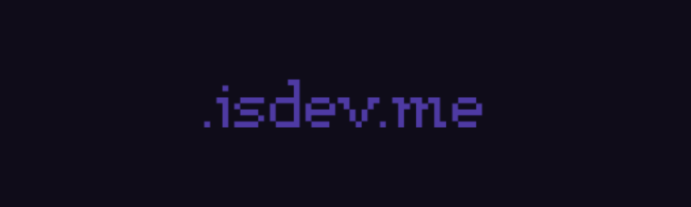

<h1>isdev.me</h1>

**FREE** `isdev.me` subdomain for personal websites, open-source projects and more. Get your own short subdomain now!  

**FOR ANY ISSUE** - admin@isdev.me

## How to get one?
1. 🌟 Star this repo.
2. 🌟 Follow [razinrayees](https://github.com/razinrayees/)
3. 🍴 Fork this repo.
4. 🧠 Think of a unique subdomain for your site.
5. 🔍 Open [`records.json`](/records.json), and use `Ctrl`+`F5` to check whether it was claimed. If it was, think of another domain.
6. ⚙️ Set the custom subdomain for your site.
7. 📄 We support many types of records (A, AAAA, CNAME, MX, TXT)
8. 🥰 Make a Pull Request to this repo.

If everything is fine, your Pull Request will be merged within 3 days, and you can enjoy your subdomain after 1~10 minutes (for the DNS record to update) after that.  
